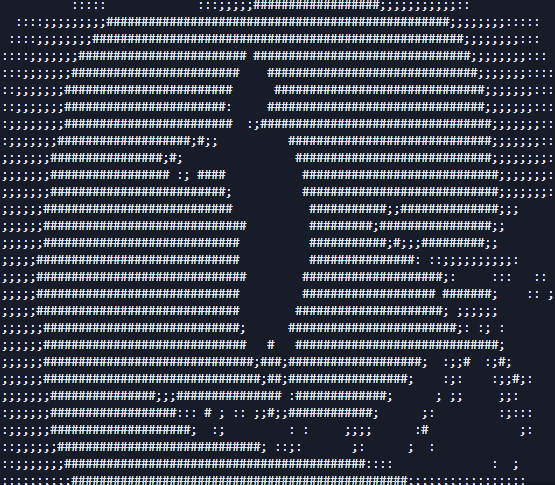

# Pemutar Video ASCII

Pemutar video berbasis Python yang dapat dijalankan di terminal dan mengonversi video menjadi seni ASCII untuk dimainkan langsung di terminal Anda. Proyek ini mengubah file video biasa menjadi animasi berbasis teks menggunakan karakter ASCII, menciptakan pengalaman menonton bergaya retro yang unik.

## Pratinjau

Berikut beberapa tangkapan layar dari Pemutar Video ASCII saat digunakan:




## Fitur

- **Konversi Video ke ASCII**: Mengubah frame video menjadi seni ASCII secara real-time  
- **Interpolasi Frame**: Menggunakan interpolasi frame agar pemutaran lebih halus  
- **Pemutaran di Terminal**: Menampilkan video ASCII langsung di terminal  
- **Dukungan Lintas Platform**: Berfungsi di Windows, macOS, dan Linux  
- **Keluaran yang Dapat Disesuaikan**: Lebar tampilan dan durasi pemutaran dapat diatur  

## Persyaratan

- Python 3.6 ke atas  
- OpenCV (opencv-python)  
- Pillow (PIL)  

## Instalasi

1. Kloning repositori ini atau unduh kode sumbernya:

```bash
git https://github.com/Valzer12/aura-farming
cd aura-farming
```

2. Instal dependensi yang diperlukan:

```bash
pip install -r requirements.txt
```

## Penggunaan

Jalankan skrip dengan file video sebagai argumen:

```bash
python ascii_video_player.py [nama_file_video]
```

Jika tidak ada file video yang ditentukan, program akan menggunakan `video.mp4` di direktori saat ini.

### Contoh

```bash
# Memutar video default
python ascii_video_player.py

# Memutar video tertentu
python ascii_video_player.py your_video.mp4
```

### Kontrol

- Tekan `Ctrl+C` untuk menghentikan pemutaran kapan saja  

## Cara Kerja

Pemutar Video ASCII bekerja melalui beberapa langkah utama:

1. **Memuat Video**: Membuka file video menggunakan OpenCV  
2. **Pemrosesan Frame**: Mengonversi setiap frame menjadi skala abu-abu  
3. **Mengubah Ukuran**: Menyesuaikan ukuran frame agar sesuai dengan lebar terminal sambil mempertahankan rasio aspek  
4. **Konversi ke ASCII**: Memetakan tingkat kecerahan piksel ke karakter ASCII  
5. **Interpolasi Frame**: Membuat frame tambahan di antara frame asli untuk pemutaran yang lebih halus  
6. **Tampilan Terminal**: Membersihkan terminal dan menampilkan setiap frame ASCII  

## Struktur Proyek

```
ascii-video-player/
├── ascii_video_player.py  # Skrip utama
├── requirements.txt       # Dependensi proyek
├── Shot.png               # Tangkapan layar pratinjau 1
├── shot1.png              # Tangkapan layar pratinjau 2
├── video.mp4              # File video default
└── ascii_frames/          # Folder untuk menyimpan frame ASCII (jika digunakan)
```

## Detail Teknis

### Konversi ASCII

Konversi dari gambar ke ASCII menggunakan kumpulan karakter dari terang ke gelap:
```
"    :;;##"
```

Kecerahan setiap piksel menentukan karakter mana yang digunakan, sehingga membentuk representasi teks dari gambar.

### Interpolasi Frame

Untuk mencapai pemutaran yang lebih halus, pemutar dapat menghasilkan frame tambahan di antara frame video asli. Hal ini dikontrol oleh parameter `interpolation_factor`, di mana nilai yang lebih tinggi menghasilkan lebih banyak frame tambahan.

## Keterbatasan

- Ukuran terminal memengaruhi kualitas seni ASCII  
- Performa tergantung pada kemampuan sistem Anda  
- Adegan dengan pergerakan sangat cepat mungkin terlihat buram dalam bentuk ASCII  

## Ucapan Terima Kasih

- Proyek ini menggunakan OpenCV untuk pemrosesan video  
- Pillow (PIL) digunakan untuk manipulasi gambar  
